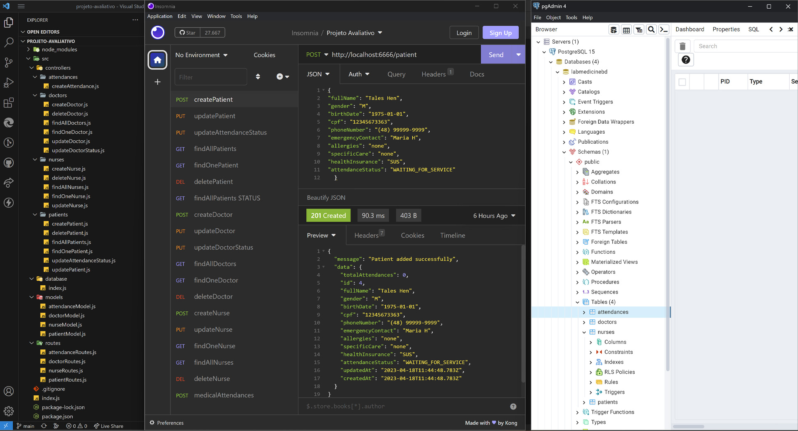

# MedicallApp

O MedicallApp é uma solução de controle de atendimentos médicos que permite a atualização do status de atendimento de um paciente para "IN_SERVICE" sempre que um atendimento é realizado. Além disso, a aplicação realiza a busca e relacionamento do paciente e médico atribuídos ao atendimento, e registra a quantidade de atendimentos que um paciente recebeu de um médico, incrementando esse número nos registros do paciente e médico envolvidos.

O projeto ainda precisa da implementação de uma estrutura front-end e de testes controlados, com o objetivo de identificar possíveis melhorias e correções.

## Tecnologias utilizadas

- ES6 (ECMAScript 6),
- PostgreSQL,
- Sequelize para Node.js,
- Express.

### Clique nos links abaixo para a descrição individual de cada etapa do projeto

:link: :arrow_right:  [S00 - Estrutura do projeto](./docs/S00%20-%20Estrutura%20do%20projeto.md)

:link: :arrow_right:  [S01 - Cadastro de Pacientes](./docs/S01%20-%20Cadastro%20de%20Pacientes.md)

:link: :arrow_right:  [S02 - Atualização dos dados de Pacientes](./docs/S02%20-%20Atualiza%C3%A7%C3%A3o%20dos%20dados%20de%20Pacientes.md)

:link: :arrow_right:  [S03 - Atualização do Status de Atendimento](./docs/S03%20-%20Atualiza%C3%A7%C3%A3o%20do%20Status%20de%20Atendimento.md)

:link: :arrow_right:  [S04 - Listagem de Pacientes](./docs/S04%20-%20Listagem%20de%20Pacientes.md)

:link: :arrow_right:  [S05 - Listagem de Paciente pelo identificador](./docs/S05%20-%20Listagem%20de%20Paciente%20pelo%20identificador.md)

:link: :arrow_right:  [S06 - Exclusão de Paciente](./docs/S06%20-%20Exclus%C3%A3o%20de%20Paciente.md)

:link: :arrow_right:  [S07 - Cadastro de Médico](./docs/S07%20-%20Cadastro%20de%20Medico.md)

:link: :arrow_right:  [S08 - Atualização dos dados de médicos](./docs/S08%20-%20Atualiza%C3%A7%C3%A3o%20dos%20dados%20de%20medicos.md)

:link: :arrow_right:  [S09 - Atualização do estado do médico no atendimento](./docs/S09%20-%20Atualiza%C3%A7%C3%A3o%20do%20estado%20do%20medico%20no%20sistema.md)

:link: :arrow_right:  [S10 - Listagem de Médicos](./docs/S10%20-%20Listagem%20de%20medicos.md)

:link: :arrow_right:  [S11 - Listagem de Médico pelo identificador](./docs/S11%20-%20Listagem%20de%20medico%20pelo%20identificador.md)

:link: :arrow_right:  [S12 - Exclusão de Médico](./docs/S12%20-%20Exclus%C3%A3o%20de%20medico.md)

:link: :arrow_right:  [S13 - Cadastro de Enfermeiro](./docs/S13%20-%20Cadastro%20de%20Enfermeiro.md)

:link: :arrow_right:  [S14 - Atualização dos dados de enfermeiros](./docs/S14%20-%20Atualiza%C3%A7%C3%A3o%20dos%20dados%20de%20enfermeiros.md)

:link: :arrow_right:  [S15 - Listagem de enfermeiros](./docs/S15%20-%20Listagem%20de%20enfermeiros.md)

:link: :arrow_right:  [S16 - Listagem de enfermeiro pelo identificador](./docs/S16%20-%20Listagem%20de%20enfermeiro%20pelo%20identificador.md)

:link: :arrow_right:  [S17 - Exclusão de enfermeiro](./docs/S17%20-%20Exclus%C3%A3o%20de%20enfermeiro.md)

:link: :arrow_right:  [S18 - Realização de Atendimento Médico](./docs/S18%20-%20Realizacao%20de%20Atendimento%20Medico.md)
