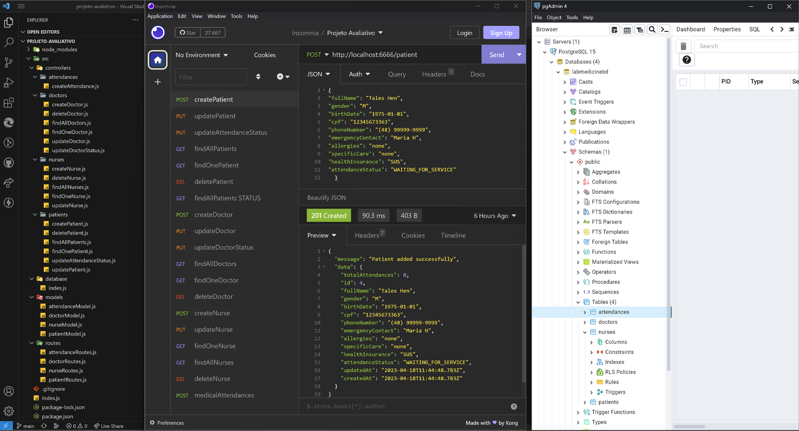

# MedicallApp

O MedicallApp é uma solução de controle de atendimentos médicos que permite a atualização do status de atendimento de um paciente para "IN_SERVICE" sempre que um atendimento é realizado. Além disso, a aplicação realiza a busca e relacionamento do paciente e médico atribuídos ao atendimento, e registra a quantidade de atendimentos que um paciente recebeu de um médico, incrementando esse número nos registros do paciente e médico envolvidos.

O projeto ainda precisa da implementação de uma estrutura front-end e de testes controlados, com o objetivo de identificar possíveis melhorias e correções.

## Tecnologias utilizadas

- ES6 (ECMAScript 6),
- PostgreSQL,
- Sequelize para Node.js,
- Express.

# Estrutura do projeto

````
projeto-avaliativo/MedicallApp
|-- src/
|   |-- controllers/
|   |   |-- attendance/
|   |   |   |-- createAttendance.js
|   |   |-- doctors/
|   |   |   |-- createDoctor.js
|   |   |   |-- deleteDoctor.js
|   |   |   |-- findAllDoctors.js
|   |   |   |-- findOneDoctor.js
|   |   |   |-- updateDoctor.js
|   |   |   |-- updateDoctorStatus.js
|   |   |-- nurses/
|   |   |   |-- createNurse.js
|   |   |   |-- deleteNurse.js
|   |   |   |-- findAllNurses.js
|   |   |   |-- findOneNurse.js
|   |   |   |-- updateNurse.js
|   |   |-- patients/
|   |   |   |-- createPatient.js
|   |   |   |-- deletePatient.js
|   |   |   |-- findAllPatients.js
|   |   |   |-- findOnePatient.js
|   |   |   |-- updateAttendanceStatus.js
|   |   |   |-- updatePatient.js
|   |-- database/
|   |   |-- index.js
|   |-- models/
|   |   |-- attendanceModel.js
|   |   |-- doctorModel.js
|   |   |-- nurseModel.js
|   |   |-- patientModel.js
|   |-- routes/
|   |   |-- attendanceRoutes.js
|   |   |-- doctorsRoutes.js
|   |   |-- nursesRoutes.js
|   |   |-- patientsRoutes.js
|-- index.js
|-- package-lock.json
|-- package.json
````

## Considerações sobre os aquivos base projeto

### |-- index.JS na raiz do projeto

    Comporta as funcionalidades do projeto

    ** Foi criada na raiz do projeto** a o diretório SRC que contém sub-diretódios para controllers, database, models e routes.

### |-- CONTROLLERS

    ** Contém os sub-diretórios para os módulos do projeto: **
    |-- attendances -  que permite o cadastro de atendimentos médicos,
    |-- doctors - que permite o cadastro de médicos,
    |-- nurses - que permite o cadastro de enfermeiros,
    |-- patients - que permite o cadastro de pacientes.

### |-- DATABASE

    Contém o arquivo INDEX.JS com os dados de conexão com o banco de dados.

### |-- MODELS

    Contém o arquivos modelos para criação dos controladores com base nas sua atribuições.

### |-- ROUTES

    Contém o arquivos das rotas (end points) para a interação com o banco de dados.
