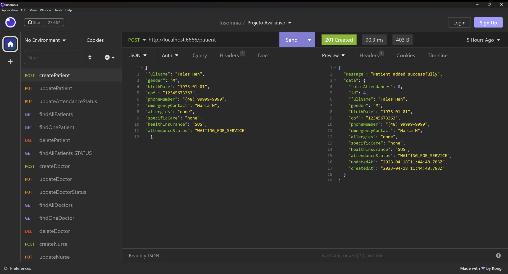

# S01 - Cadastro de Pacientes

Insersão de paciente com informações detalhadas

## Implementações

- Insersão de paciente com validação de campos obrigatórios
- Validação de CPF único por paciente
- Retorno de código de identificação do novo paciente cadastrado
- Respostas de status HTTP

## Endpoints

### Endpoint de Criação de Pacientes

- **URL**: `POST /api/patient`
- **Content-Type**: `application/json`
- **Corpo da Requisição**: Objeto JSON com os campos obrigatórios: `fullName`, `gender`, `birthDate`, `cpf`, `phoneNumber`, `emergencyContact`, `allergies`, `specificCare` e `healthInsurance`

# Teste da API de Cadastro de Pacientes no Insomnia

O endpoint ficou: `http://localhost:6666/patient`

Exemplo de dados no corpo da requisição, informe os dados de um novo paciente em formato JSON.

````
{
"fullName": "Tales Henn",
"gender": "M",
"birthDate": "1975-01-01",
"cpf": "12345678667",
"phoneNumber": "(48) 99999-9999",
"emergencyContact": "Maria H",
"allergies": "none",
"specificCare": "none",
"healthInsurance": "SUS",
"attendanceStatus": "WAITING_FOR_SERVICE"
}
````

# Resposta de Sucesso

```
{
 "message": "Patient added successfully",
 "data": {
  "totalAttendances": 0,
  "id": 5,
  "fullName": "Tales Henn",
  "gender": "M",
  "birthDate": "1975-01-01",
  "cpf": "12345678667",
  "phoneNumber": "(48) 99999-9999",
  "emergencyContact": "Maria H",
  "allergies": "none",
  "specificCare": "none",
  "healthInsurance": "SUS",
  "attendanceStatus": "WAITING_FOR_SERVICE",
  "updatedAt": "2023-04-12T22:14:50.525Z",
  "createdAt": "2023-04-12T22:14:50.525Z"
 }
}
```

# Possíveis respostas de erro

```
{ "message": "CPF already registered" }

{ "message": "Missing required fields" }
```

### final do Projeto S01 - Cadastro de Pacientes
