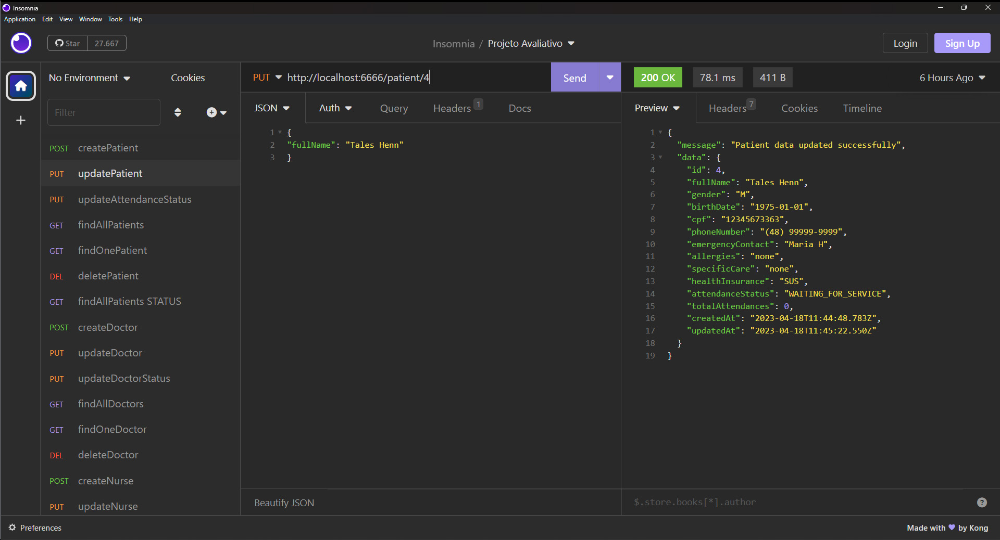

# S02 - Atualização dos dados de Pacientes

## Implementações

Foi criado o arquivo updatePatient.JS para atualizar dados do paciente e se sucesso
retornar mensagem com de confirmação e o dados do paciente já atualizados.
A busca é feita pelo ID do paciente e retorna mensagem de erro se não for encontrado.
O método atualiza somente os dados QUE FOREM FORNECIDOS e mantém o que já existentes.

Foi atualizado o arquivo patientRoutes.js

- **URL**: `PUT /api/patient/:ID`

O endpoint ficou : `http://localhost:6666/patient/{identificador}`

E exemplo de alteração

````
{
  "fullName": "Tales Henn"
}
````

# Resposta de Sucesso

````
{
 "message": "Patient data updated successfully",
 "data": {
  "id": 2,
  "fullName": "Tales Henn",
  "gender": "M",
  "birthDate": "1975-01-01",
  "cpf": "12345678905",
  "phoneNumber": "(48) 99999-9999",
  "emergencyContact": "Maria H",
  "allergies": "none",
  "specificCare": "none",
  "healthInsurance": "SUS",
  "attendanceStatus": null,
  "totalAttendances": 0,
  "createdAt": "2023-04-12T13:20:42.664Z",
  "updatedAt": "2023-04-12T16:42:48.910Z"
 }
}
````

# Possíveis respostas de erro

````
{"message": "Unable to update patient data"}

{"message": "Patient not found"}
````

### final do projeto S02 - Atualização dos dados de Pacientes
