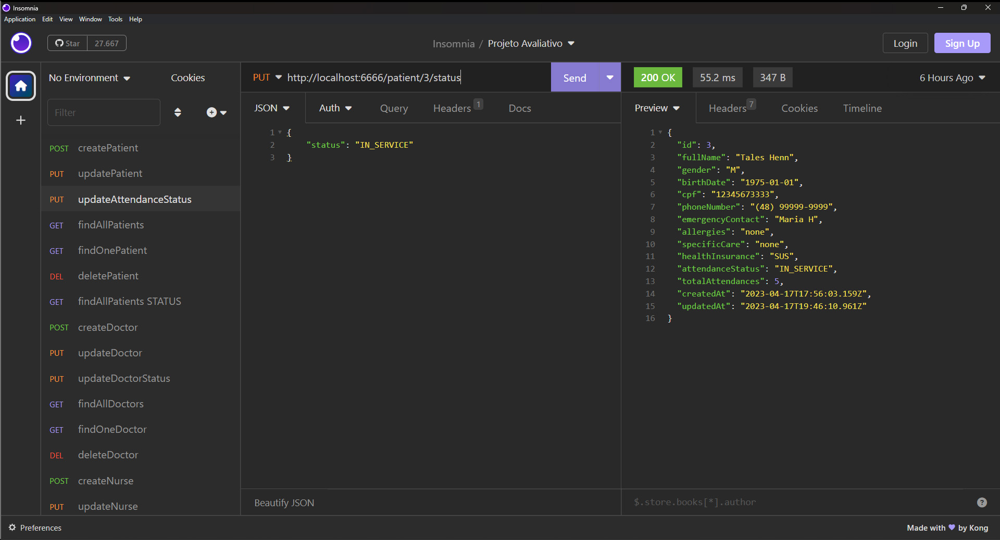

# S03 - Atualização do Status de Atendimento

## Implementações

Foi criado um controller updateAttendanceStatus.js
Foi atualizado o arquivo patientRoutes.js
É feito a busca pelo identificados do paciente atraves da rota status e enviado
pelo corpo da requisiçao a chave com o novo valor possível.

- **URL**: `PUT /api/patient/:ID/status`

O endpoint ficou : `http://localhost:6666/patient/:ID/status`

E exemplo de alteração

````
{
  "status": "SERVED"
}
````

# Resposta de Sucesso

```
{
 "id": 4,
 "fullName": "Thales Hennn",
 "gender": "M",
 "birthDate": "1975-01-01",
 "cpf": "12345678666",
 "phoneNumber": "(48) 99999-9999",
 "emergencyContact": "Maria H",
 "allergies": "none",
 "specificCare": "none",
 "healthInsurance": "SUS",
 "attendanceStatus": "SERVED",
 "totalAttendances": 0,
 "createdAt": "2023-04-12T17:31:21.946Z",
 "updatedAt": "2023-04-12T18:01:11.620Z"
}
```

# Possíveis respostas de erro

````
{ error: "Invalid attendance status." }

{ error: "Patient not found." }

{ error: "Error updating patient attendance status.",
error: error.message, }
````

### final do projeto S03 - Atualização do Status de Atendimento
