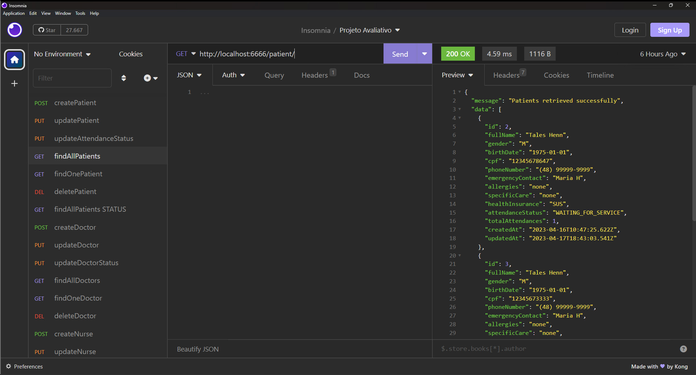

# S04 - Listagem de Pacientes

## Implementações

Foi criado um controller findAllPatients.js
Foi atualizado o arquivo patientRoutes.js
E funcionalidade busca todos os pacientes no banco de dados.

- **URL**: `GET /api/patient/`

O endpoint ficou : `http://localhost:6666/patient`

Não precisa informar nada no corpo da requisição

# Resposta de Sucesso

Listará todos os pacientes

````

{
 "message": "Patients retrieved successfully",
 "data":
  [
    {
   "id": 3,
   "fullName": "Thales Henn",
   "gender": "M",
   "birthDate": "1975-01-01",
   "cpf": "12345678907",
   "phoneNumber": "(48) 99999-9999",
   "emergencyContact": "Maria H",
   "allergies": "none",
   "specificCare": "none",
   "healthInsurance": "SUS",
   "attendanceStatus": null,
   "totalAttendances": 0,
   "createdAt": "2023-04-12T17:05:25.553Z",
   "updatedAt": "2023-04-12T17:05:25.553Z"
  }
  ] }

````

# Possível resposta de erro

````

{ message: "Failed to retrieve patients", error: error.message }

````

### final do projeto S04 - Listagem de Pacientes
