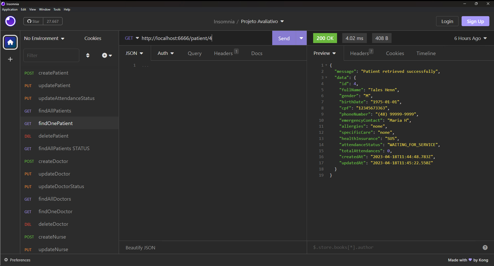

# S05 - Listagem de Paciente pelo identificador

Foi criado um controller findOnePatient.js
Foi atualizado o arquivo patientRoutes.js
A busca é feita pelo identificador do paciente e retorna mensagem de erro se não for encontrado.

- **URL**: `GET /api/patient/:ID`

O endpoint ficou : `http://localhost:6666/patient/:ID`

Não precisa informar nada no corpo da requisição

# Resposta de Sucesso

````
{
 "message": "Patient retrieved successfully",
 "data": {
  "id": 4,
  "fullName": "Thales Hennn",
  "gender": "M",
  "birthDate": "1975-01-01",
  "cpf": "12345678666",
  "phoneNumber": "(48) 99999-9999",
  "emergencyContact": "Maria H",
  "allergies": "none",
  "specificCare": "none",
  "healthInsurance": "SUS",
  "attendanceStatus": "SERVED",
  "totalAttendances": 0,
  "createdAt": "2023-04-12T17:31:21.946Z",
  "updatedAt": "2023-04-12T18:01:11.620Z"
 }
}
````

# Possíveis respostas de erro

````
{ message: "Patient retrieved successfully", data: patient }

{ message: "Patient not found" }

{ message: "Failed to retrieve patient", error: error.message }

````

### final do projeto S05 - Listagem de Paciente pelo identificador
