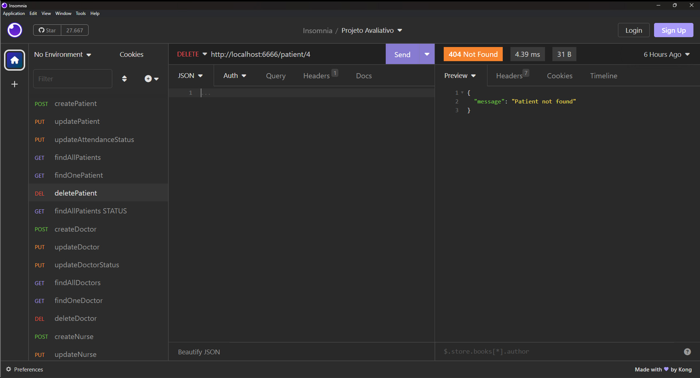

# S06 - Exclusão de Paciente

Foi criado um controller deletePatient.js
Foi atualizado o arquivo patientRoutes.js
A busca é feita pelo identificador do paciente e retorna mensagem de erro se não for encontrado.

- **URL**: `DELETE /api/patient/:ID`

O endpoint ficou : `http://localhost:6666/patient/:ID`

Não precisa informar nada no corpo da requisição
Não há resposta de sucesso

# Possíveis respostas de erro

````

{ message: "Patient not found" }

{ message: "Failed to delete patient", error: error.message }
````

### final do projeto S06 - Exclusão de Paciente
