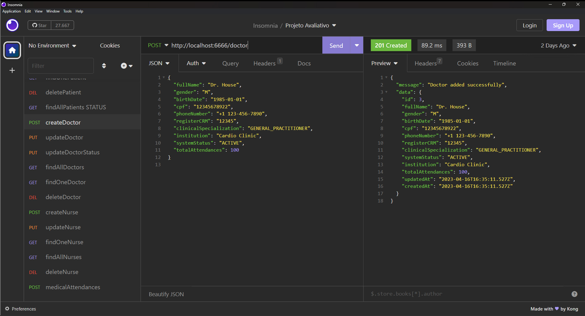

# Projeto S07 - Cadastro de Médico

Insersão de médico com informações detalhadas

## Implementações

- Insersão de médico com validação de campos obrigatórios
- Validação de CPF único por médico
- Retorno de código de identificação do médico cadastrado
- Respostas de status HTTP

## Endpoints

### Endpoint de Criação de Pacientes

- **URL**: `POST /api/doctor`
- **Content-Type**: `application/json`
- **Corpo da Requisição**: Objeto JSON com os campos obrigatórios: `fullName`, `gender`, `birthDate`, `cpf`, `phoneNumber`, `registerCRM`, `clinicalSpecialization` e `institution`

# Teste da API de Cadastro de Pacientes no Insomnia

O endpoint ficou: `http://localhost:6666/doctor`

Exemplo de dados no corpo da requisição, informe os dados de um novo paciente em formato JSON.

{
  "fullName": "Dr. John Doe",
  "gender": "M",
  "birthDate": "1985-01-01",
  "cpf": "12345678901",
  "phoneNumber": "+1 123-456-7890",
  "registerCRM": "12345",
  "clinicalSpecialization": "GENERAL_PRACTITIONER",
  "institution": "Cardio Clinic",
  "systemStatus": "ACTIVE",
  "totalAttendances": 100
}

# Resposta de Sucesso

```
{
 "message": "Doctor added successfully",
 "data": {
  "id": 2,
  "fullName": "Dr. John Doe",
  "gender": "M",
  "birthDate": "1985-01-01",
  "cpf": "12345678901",
  "phoneNumber": "+1 123-456-7890",
  "registerCRM": "12345",
  "clinicalSpecialization": "GENERAL_PRACTITIONER",
  "systemStatus": "ACTIVE",
  "institution": "Cardio Clinic",
  "totalAttendances": 100,
  "updatedAt": "2023-04-15T20:29:56.868Z",
  "createdAt": "2023-04-15T20:29:56.868Z"
 }
}
```

# Possíveis respostas de erro

```
{ message: "CPF already registered" }

{ message: "Missing required fields" }

{ message: "An error occurred while adding the doctor", error: error.message }
```

### final do Projeto S07 - Cadastro de Médico
