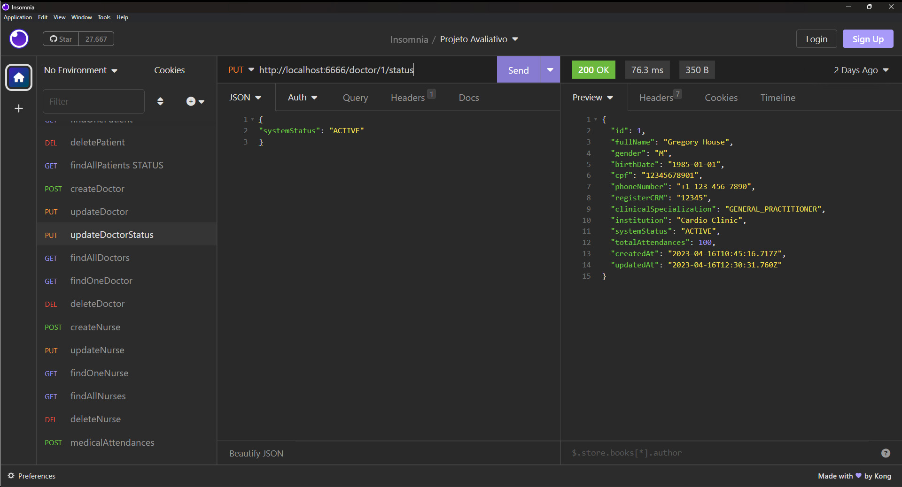

# S08 - Atualização dos dados de médicos

## Implementações

Foi criado o arquivo updateDoctor.JS para atualizar dados do médico e se sucesso
retornar mensagem com de confirmação e o dados do médico já atualizados.
A busca é feita pelo ID do médico e retorna mensagem de erro se não for encontrado.
O método atualiza somente os dados QUE FOREM FORNECIDOS e mantém o que já existentes.

Foi atualizado o arquivo doctorRoutes.js

- **URL**: `PUT /api/doctor/:ID`

O endpoint ficou : `http://localhost:6666/doctor/{identificador}`

Exemplo de alteração

````
{
  "fullName": "Gregory House"
}
````

# Resposta de Sucesso

````
{
 "message": "Doctor data updated successfully",
 "data": {
  "id": 1,
  "fullName": "Gregory House",
  "gender": "M",
  "birthDate": "1985-01-01",
  "cpf": "12345678901",
  "phoneNumber": "+1 123-456-7890",
  "registerCRM": "12345",
  "clinicalSpecialization": "GENERAL_PRACTITIONER",
  "institution": "Cardio Clinic",
  "systemStatus": "ACTIVE",
  "totalAttendances": 100,
  "createdAt": "2023-04-16T10:45:16.717Z",
  "updatedAt": "2023-04-16T11:37:11.484Z"
 }
}
````

# Possíveis respostas de erro

````
{"message": "Unable to update doctor data"}

{"message": "Doctor not found"}
````

### final do Projeto S08 - Atualização dos dados de médicos
