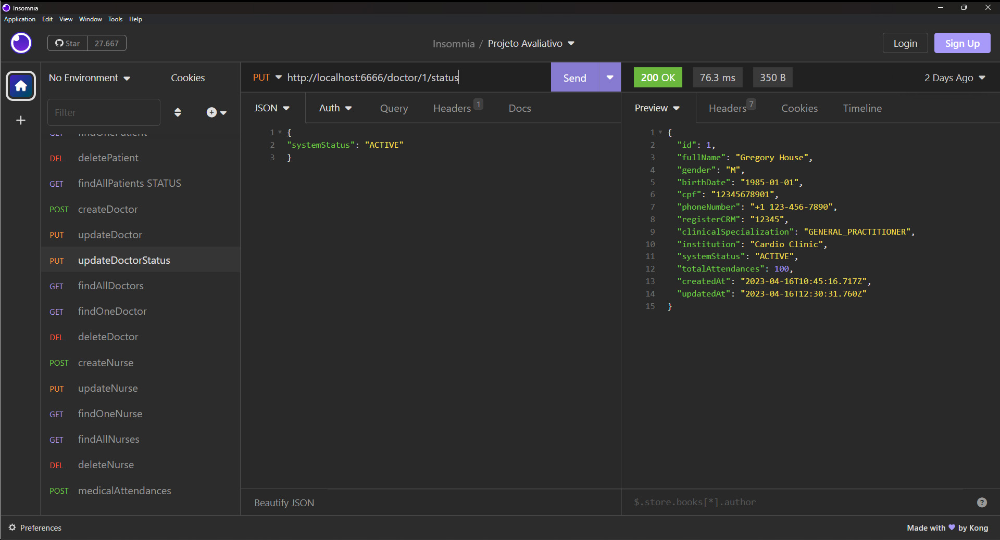

# S09 - Atualização do estado do médico no atendimento

## Implementações

Foi criado um controller updateAttendanceStatus.js
Foi criado o arquivo attendanceRoutes.js
É feito a busca pelo identificador do médico atraves da rota status e enviado
pelo corpo da requisiçao a chave com o novo valor possível.

- **URL**: `PUT /api/doctor/:ID/status`

O endpoint ficou : `http://localhost:6666/doctor/:ID/status`

Exemplo de alteração

````
{
"systemStatus": "ACTIVE"
}
````

# Resposta de Sucesso

```
{
 "id": 1,
 "fullName": "Gregory House",
 "gender": "M",
 "birthDate": "1985-01-01",
 "cpf": "12345678901",
 "phoneNumber": "+1 123-456-7890",
 "registerCRM": "12345",
 "clinicalSpecialization": "GENERAL_PRACTITIONER",
 "institution": "Cardio Clinic",
 "systemStatus": "ACTIVE",
 "totalAttendances": 100,
 "createdAt": "2023-04-16T10:45:16.717Z",
 "updatedAt": "2023-04-16T12:30:31.760Z"
}
```

# Possíveis respostas de erro

````
{ error: "Status not valid." }

{ error: "Doctor not found." }

{ error: "Unable to update doctor data", message: error.message, }
````

### final do Projeto 09 - Atualização do estado do médico no atendimento
