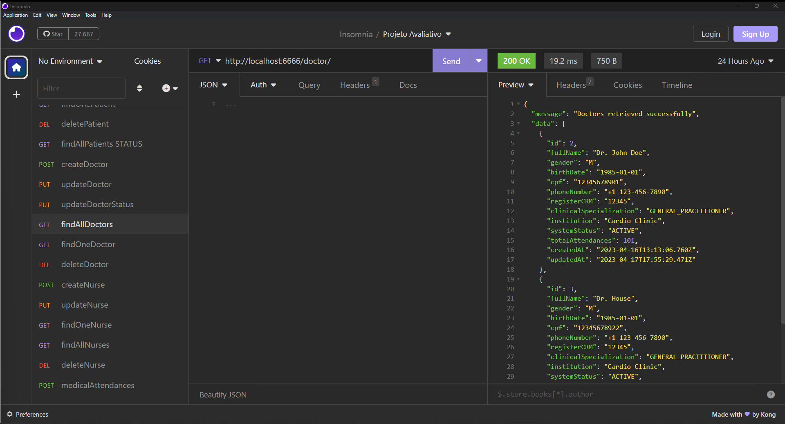

# S10 - Listagem de Médicos

## Implementações

Foi criado um controller findAllDoctors.js
Foi atualizado o arquivo doctorRoutes.js
A funcionalidade busca todos os médicos no banco de dados.

- **URL**: `GET /api/doctor/`

O endpoint ficou : `http://localhost:6666/doctor`

Não precisa informar nada no corpo da requisição

# Resposta de Sucesso

Listará todos os medicos

````

{
 "message": "Doctors retrieved successfully",
 "data": [
  {
   "id": 1,
   "fullName": "Gregory House",
   "gender": "M",
   "birthDate": "1985-01-01",
   "cpf": "12345678901",
   "phoneNumber": "+1 123-456-7890",
   "registerCRM": "12345",
   "clinicalSpecialization": "GENERAL_PRACTITIONER",
   "institution": "Cardio Clinic",
   "systemStatus": "ACTIVE",
   "totalAttendances": 100,
   "createdAt": "2023-04-16T10:45:16.717Z",
   "updatedAt": "2023-04-16T12:30:31.760Z"
  }
 ]
}

````

# Possível resposta de erro

````

{ message: "Failed to retrieve doctors", error: error.message }

````

### final do Projeto S10 - Listagem de Médicos
