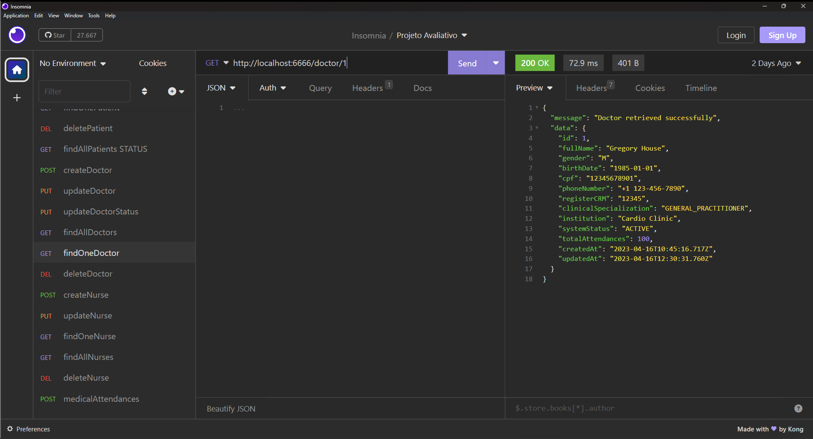

# S11 - Listagem de Médico pelo identificador

Foi criado um controller findOneDoctor.js
Foi atualizado o arquivo doctorRoutes.js
A busca é feita pelo identificador do médico e retorna mensagem de erro se não for encontrado.

- **URL**: `GET /api/doctor/:ID`

O endpoint ficou : `http://localhost:6666/doctor/:ID`

Não precisa informar nada no corpo da requisição

# Resposta de Sucesso

````
{
 "message": "Doctor retrieved successfully",
 "data": {
  "id": 1,
  "fullName": "Gregory House",
  "gender": "M",
  "birthDate": "1985-01-01",
  "cpf": "12345678901",
  "phoneNumber": "+1 123-456-7890",
  "registerCRM": "12345",
  "clinicalSpecialization": "GENERAL_PRACTITIONER",
  "institution": "Cardio Clinic",
  "systemStatus": "ACTIVE",
  "totalAttendances": 100,
  "createdAt": "2023-04-16T10:45:16.717Z",
  "updatedAt": "2023-04-16T12:30:31.760Z"
 }
}
````

# Possíveis respostas de erro

````
{ message: "Doctor not found" }

{ message: "Failed to retrieve doctor", error: error.message }

````

### final do Projeto S11 - Listagem de Médico pelo identificador
