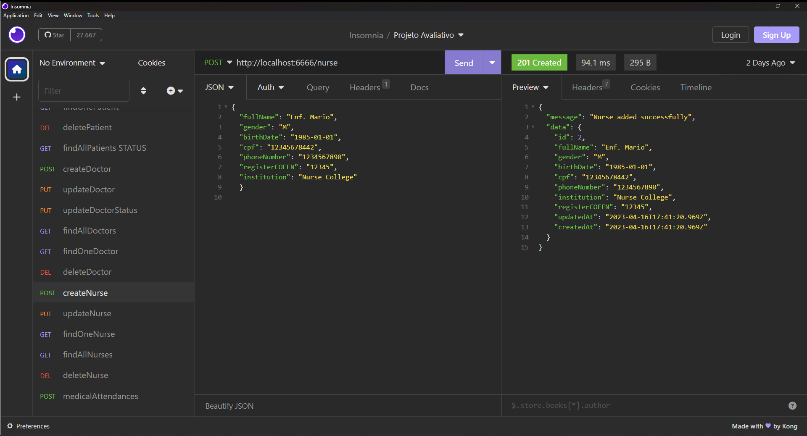

# S13 - Cadastro de Enfermeiro

Insersão de enfermeiro com informações detalhadas

## Implementações

- Insersão de enfermeiro com validação de campos obrigatórios
- Validação de CPF único por enfermeiro
- Retorno de código de identificação do enfermeiro cadastrado
- Respostas de status HTTP

## Endpoints

### Endpoint de Criação de Pacientes

- **URL**: `POST /api/nurse`
- **Content-Type**: `application/json`
- **Corpo da Requisição**: Objeto JSON com os campos obrigatórios: `fullName`, `gender`, `birthDate`, `cpf`, `phoneNumber`, `registerCOFEN` e `institution`

# Teste da API de Cadastro de Pacientes no Insomnia

O endpoint ficou: `http://localhost:6666/nurse`

Exemplo de dados no corpo da requisição, informe os dados de um novo enfermeiro em formato JSON.

{
  "fullName": "Enf. Maria",
  "gender": "F",
  "birthDate": "1985-01-01",
  "cpf": "12345678922",
  "phoneNumber": "1234567890",
  "registerCOFEN": "12345",
  "institution": "Nurse College"
  }

# Resposta de Sucesso

```
{
 "message": "Nurse added successfully",
 "data": {
  "id": 1,
  "fullName": "Enf. Maria",
  "gender": "F",
  "birthDate": "1985-01-01",
  "cpf": "12345678922",
  "phoneNumber": "1234567890",
  "institution": "Nurse College",
  "registerCOFEN": "12345",
  "updatedAt": "2023-04-16T16:57:07.211Z",
  "createdAt": "2023-04-16T16:57:07.211Z"
 }
}
```

# Possíveis respostas de erro

```
{ message: "CPF already registered" }

{ message: "Missing required fields" }

{ message: "An error occurred while adding the nurse", error: error.message }
```

### final do Projeto S13 - Cadastro de Enfermeiro
