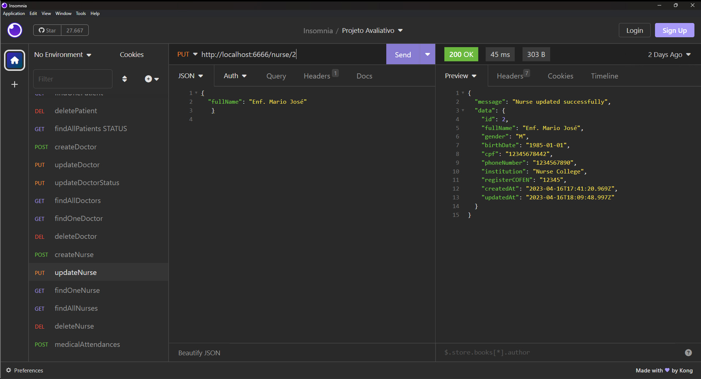

# S14 - Atualização dos dados de enfermeiros

## Implementações

Foi criado o arquivo updateNurse.JS para atualizar dados do enfermeiro e se sucesso
retornar mensagem com de confirmação e o dados do enfermeiro já atualizados.
A busca é feita pelo ID do enfermeiro e retorna mensagem de erro se não for encontrado.
O método atualiza somente os dados QUE FOREM FORNECIDOS e mantém o que já existentes.

Foi atualizado o arquivo nurseRoutes.js

- **URL**: `PUT /api/nurse/:ID`

O endpoint ficou : `http://localhost:6666/nurse/{identificador}`

Exemplo de alteração

````
{ 
  "fullName": "Enf. Mario José"
}

````

# Resposta de Sucesso

````
{
 "message": "Nurse updated successfully",
 "data": {
  "id": 2,
  "fullName": "Enf. Mario José",
  "gender": "M",
  "birthDate": "1985-01-01",
  "cpf": "12345678442",
  "phoneNumber": "1234567890",
  "institution": "Nurse College",
  "registerCOFEN": "12345",
  "createdAt": "2023-04-16T17:41:20.969Z",
  "updatedAt": "2023-04-16T18:09:48.997Z"
 }
}
````

# Possíveis respostas de erro

````
{"message": "Unable to update nurse data"}

{"message": "Nurse not found"}
````

### final do Projeto S14 - Atualização dos dados de enfermeiros
