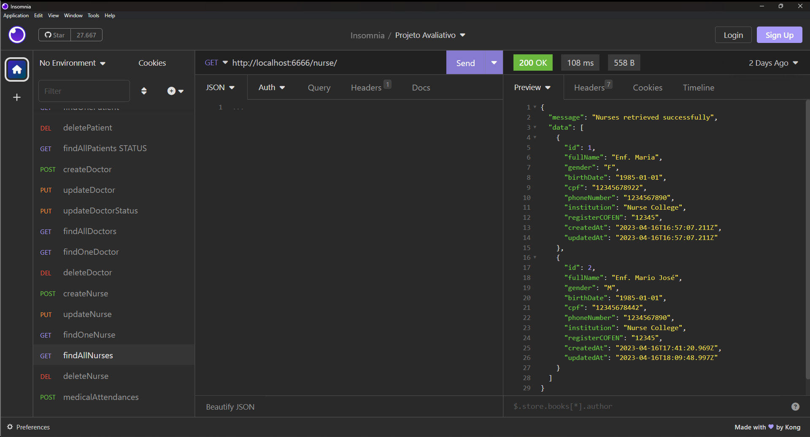

# S15 - Listagem de enfermeiros

## Implementações

Foi criado um controller findAllNurses.js
Foi atualizado o arquivo nursesRoutes.js
A funcionalidade busca todos os enfermeiros no banco de dados.

- **URL**: `GET /api/nurse/`

O endpoint ficou : `http://localhost:6666/nurse`

Não precisa informar nada no corpo da requisição

# Resposta de Sucesso

Listará todos os enfermeiros

````

{
 "message": "Nurses retrieved successfully",
 "data": [
  {
   "id": 1,
   "fullName": "Enf. Maria",
   "gender": "F",
   "birthDate": "1985-01-01",
   "cpf": "12345678922",
   "phoneNumber": "1234567890",
   "institution": "Nurse College",
   "registerCOFEN": "12345",
   "createdAt": "2023-04-16T16:57:07.211Z",
   "updatedAt": "2023-04-16T16:57:07.211Z"
  }
 ]
}

````

# Possível resposta de erro

````

{ message: "Failed to retrieve nurses", error: error.message }

````

### final do Projeto S15 - Listagem de enfermeiros
