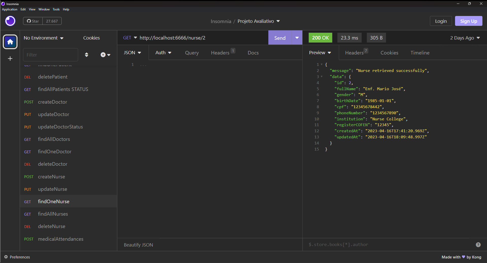

# S16 - Listagem de enfermeiro pelo identificador

Foi criado um controller findOneNurse.js
Foi atualizado o arquivo nurseRoutes.js
A busca é feita pelo identificador do enfermeiro e retorna mensagem de erro se não for encontrado.

- **URL**: `GET /api/nurse/:ID`

O endpoint ficou : `http://localhost:6666/nurse/:ID`

Não precisa informar nada no corpo da requisição

# Resposta de Sucesso

````
{
 "message": "Nurse retrieved successfully",
 "data": {
  "id": 2,
  "fullName": "Enf. Mario José",
  "gender": "M",
  "birthDate": "1985-01-01",
  "cpf": "12345678442",
  "phoneNumber": "1234567890",
  "institution": "Nurse College",
  "registerCOFEN": "12345",
  "createdAt": "2023-04-16T17:41:20.969Z",
  "updatedAt": "2023-04-16T18:09:48.997Z"
 }
}
````

# Possíveis respostas de erro

````
{ message: "Nurse not found" }

{ message: "Failed to retrieve nurse", error: error.message }

````

### final do Projeto S16 - Listagem de enfermeiro pelo identificador
