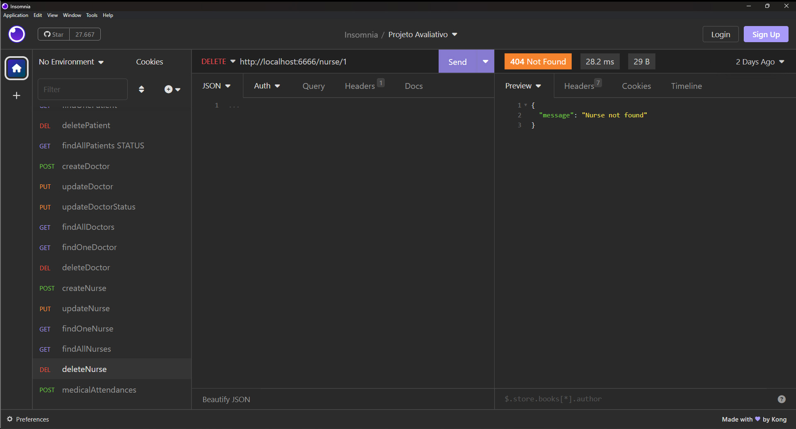

# S17 - Exclusão de enfermeiro

Foi criado um controller deleteNurse.js
Foi atualizado o arquivo nurseRoutes.js
A busca é feita pelo identificador do enfermeiro e retorna mensagem de erro se não for encontrado.

- **URL**: `DELETE /api/nurse/:ID`

O endpoint ficou : `http://localhost:6666/nurse/:ID`

Não precisa informar nada no corpo da requisição

# Não há resposta de sucesso

# Possíveis respostas de erro

````

{ message: "Nurse not found" }

{ message: "Failed to delete nurse", error: error.message }
````

### final do Projeto S17 - Exclusão de enfermeiro
