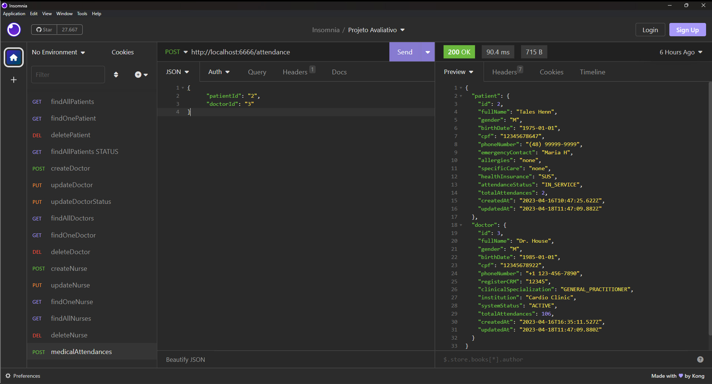

# S18 - Realização de Atendimento Médico

Simula um cadastro de atendimento médico.

## Implementações

- Foi criado um controller createAttendance.js
- Foi criado um model attendanceModel.js
- Foi criado o arquivo end point attendanceRoutes.js

- Criação de atendimento médico com validação de campos obrigatórios,
- Atualização dos atributos de atendimento do paciente e médico envolvidos,
- Atualização do status de atendimento do paciente para "IN_SERVICE",
- Respostas de status HTTP para requisições válidas e inválidas,

## Endpoints

### Endpoint de Criação de Pacientes

- **URL**: `POST /api/attendance`
- **Content-Type**: `application/json`
- **Corpo da Requisição**: Objeto JSON com os campos obrigatórios: patientId (ID do paciente) e doctorId (ID do médico)

# Teste da API de Cadastro de Pacientes no Insomnia

O endpoint ficou: `http://localhost:6666/attendance`

Exemplo de dados no corpo da requisição, informe os dados de um novo paciente em formato JSON.

{
   "patientId": "3",
   "doctorId": "3"
}

# Resposta de Sucesso

```
{
 "patient": {
  "id": 3,
  "fullName": "Tales Henn",
  "gender": "M",
  "birthDate": "1975-01-01",
  "cpf": "12345673333",
  "phoneNumber": "(48) 99999-9999",
  "emergencyContact": "Maria H",
  "allergies": "none",
  "specificCare": "none",
  "healthInsurance": "SUS",
  "attendanceStatus": "IN_SERVICE",
  "totalAttendances": 4,
  "createdAt": "2023-04-17T17:56:03.159Z",
  "updatedAt": "2023-04-17T18:55:56.875Z"
 },
 "doctor": {
  "id": 3,
  "fullName": "Dr. House",
  "gender": "M",
  "birthDate": "1985-01-01",
  "cpf": "12345678922",
  "phoneNumber": "+1 123-456-7890",
  "registerCRM": "12345",
  "clinicalSpecialization": "GENERAL_PRACTITIONER",
  "institution": "Cardio Clinic",
  "systemStatus": "ACTIVE",
  "totalAttendances": 104,
  "createdAt": "2023-04-16T16:35:11.527Z",
  "updatedAt": "2023-04-17T18:55:56.877Z"
 }
}
```

# Possíveis respostas de erro

```
{ error: "Patient and doctor identifier are required"}

{ error: "Patient or doctor not found." }

{ error: "Error creating attendance:" }
```

### final do Projeto Projeto S18 - Realização de Atendimento Médico
